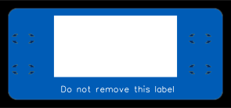
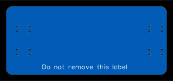

# Cable label

A label for labelling cables.

The label is designed to be attached to a cable using two cable ties.
The label can be marked with a permanent marker or a laser engraver.
This label was primarily designed to be attached to Ethernet cables but should work on others cables as well.

## Two options

There are two options for the manufacturing this label:

* Making a Printed circuit board (PCB) using the files in the [PCB](./PCB) directory.
* Laser cutting the label out of acrylic, plywood or similar using the files in the [Laser cuttable](./Laser%20cuttable) directory.

### PCB

TODO: Add photo of completed label attached to a cable

### Laser cuttable

TODO: Add photo of completed label attached to a cable

## Licence

Copyright © 2023 Phil Baldwin

This work is licensed under a Creative Commons Attribution-ShareAlike 4.0 International License.

You should have received a copy of the license along with this work. If not, see <http://creativecommons.org/licenses/by-sa/4.0/>.
