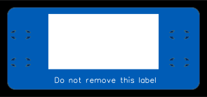
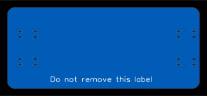

# Cable label

A label for labelling cables.

The label is designed to be attached to a cable using two cable ties.
The label can be marked with a permanent marker or a laser engraver.
This label was primarily designed to be attached to Ethernet cables but should work on others cables as well.

The label was designed as a printed circuit board and can be manufactured from the Gerber files. The DXF file could also probably be laser cut to make the label out of acrylic, plywood or similar. I will probably redraw it in Inkscape to make a SVG file for laser cutting in the future.

TODO: Add photo of completed label attached to a cable

## Licence

Copyright © 2023 Phil Baldwin

This work is licensed under a Creative Commons Attribution-ShareAlike 4.0 International License.

You should have received a copy of the license along with this work. If not, see <http://creativecommons.org/licenses/by-sa/4.0/>.
